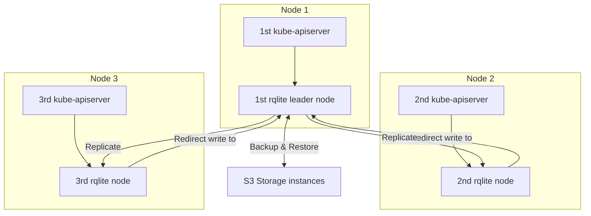

# Kubernetes Cluster architecture

This documentation introduce every needed components into to instantiate a Kubernetes Cluster in the Fyllament way.
We recommend you to read this documentation to understand approaches adopted by Fyllament abotu which service is use and reasons that help you understand the complete design of the solution.

## Vitale components

Vitale components is the minimal components needed to at least have a vanilla Kubernetes cluster.
Some of used services is not from standard way indicate by the [official Kubernetes documentation](https://kubernetes.io/fr/docs/concepts/overview/components/).
Perhaps, those changes from the standard way is well documented.

A cluster is composed of a `controle plane`:
- `kube-scheduler`
- `kube-controller-manager`
- `kube-apiserver`
- `data-storage`

And a `worker plane`:

- `kubelet`
- **Container Runtime**
- **Network manager**

## Controle plane components

The controle plane is the brain of the cluster. It must be available and scalable to ensure worker plane can access to it and continue work.
We talk about SLA to 99.99% of availability.
To warranty those availability it must have a data storage that is reliable and high available.

### Data storage

The recommended service as data storage is [**etcd**](#source--references).
ETCD is scalable and fault tolerent solution based on a clustering method. So means to be reliable and high available.
But, this solution has a really drawbacks. It's about his really slow performance when it face to a very high traffic within several node and reach rapidly its read/write limit.

Fyllament aim to be a high performance clustering solution allowing to join really high amount of node (more than 100 recommended by Kubernetes).
To warranty database performance, Fyllament needs a low level database with native portability between linux distributions.

The choosen service is **rqlite** based on the speed of the **sqlite** C library.
But what is **sqlite** ?

**sqlite** is a C library binary storing data into a file.
Thanks to C language, the solution is really performant in read/write operation (depending on storage capabilities). With this approach it's easy to backup and recover data partition.

**rqlite** add a another layer of technical logique that aim **sqlite** allow to be scalable (high availability) and apply on data file storage a raft algorithm to ensure fault-tolerant with remotes instance.
With those argument, we can finally say **rqlite** is a reliable data storage using SQL syntax.

### Standard components

Except data storage service, all others minimum service will from [official Kubernetes components]():
- `kube-scheduler`: Indicate which pod will running on which node
- `kube-controller-manager`: 
- `kube-apiserver`: That handle all resgitered resources 

## Worker plane components

As explain above in [vitale components](#vitale-components), the worker plane is composed of:
- `kubelet`: Watch resource changes from `kube-apiserver` and apply them by ordering **Container Runtime** container behaviour. 
- **Container Runtime**: The container runtime is responsible to manage container.
- **Network manager**: The network manager create network asset to allow **Services** resource to redirect the flux into expose container.

### Network Manager

The network manager service aims to provider a network interface to `Service` resource relaying traffic to targeted pod.
To achieve this need, it manipulate low level of network or directly iptable kernel function.
Perhaps there is some needed criteria about a network manager:
- Tracable by giving metrics and logs
- Secure by default and configurable for more specific security approach
- Support a large amount of traffic (nodes).

The network manager tool choose is **Calico** to about limitation about large scale cluster and with less limit using metrics exportations.
It support eBPF protocol and allow low level network manipulation with efficiency.

### Container Engine

A container engine aims to communicate with container runtime to manage container related to they need.

To communicate with container runtime, a API standard is defined named CRI (Container Runtime Interface) drive by Kubernetes maintainers.

This specification indicate what API implementation it need to be usable by a **Kubelet** service.

It exists 2 mains container engine that implements the CRI standard:

**Containerd**:
Maintained by and used with docker. It does not warrantly compatibility of the CRI standard because proprietary particularity of docker inc.

**CRI-O**:
Common CRI used into the Kubernetes ecosystem, and is totally open-source.
It's created with the collaboration of Red Hat, Google, Amazon, Apple, and other...

So **CRI-O** will be the CRI to used in this self-managed Kubernetes Cluster implementation.

### Container Runtime

A **container runtime** use kernel features to operate containers directly.

It exists many container runtime as:

- `crun`: Low level implementation of OCI standard runtime write in C
- `runc`: Low level implementation of OCI standard runtime write in Go
- `youki`: Low level implementation of OCI standard runtime write in Rust
- `gVisor`: Low level implementation of OCI standard runtime write in C using KVM to as container.

The used container runner is `crun` for it's low level implementation and it's a common service used.

## Source & References

- [Kubernetes](https://kubernetes.io): Container orchestrator
- [Data storage](): Service to persist information
- [Reliability](): Concept of data consistency and availability when it stored  
- [High availability](): Terms about scalability when one instance failed, another take the resume
- [CAP Theorem](https://www.julianbrowne.com/article/brewers-cap-theorem/): Explain that a database can integrate only two of three principles about data storage
- [ETCD](https://etcd.io/): Reliable key/value data storage
- [rqlite](https://rqlite.io/): Reliable SQL data storage build on top of sqlite
- [sqlite](https://sqlite.io/):  A C library that use a single file as database.
- [Calico](https://calico.io/): A network manager of CNCF
- [runc](https://github.com/opencontainers/runc): A container runtime that manipulate directly containers 
- [cri-o](https://github.com/cri-o/cri-o): A container engine that implement CRI standard to communicate with container runtime 
- [containerd](https://github.com/containerd/containerd): A container engine that implement CRI standard to communicate with container runtime 
- [eBPF](): A network protocol that directly manipulate layer 4 of the OCI model by handle packet transfert.
